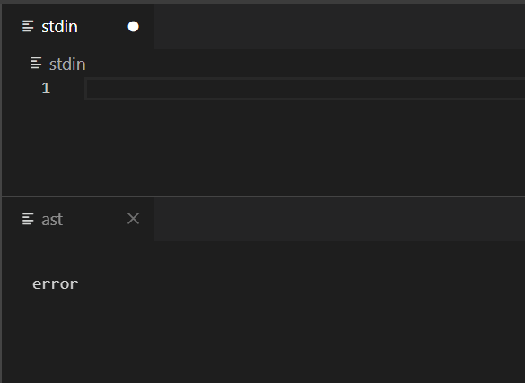
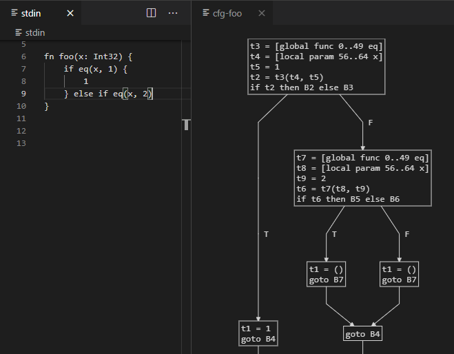
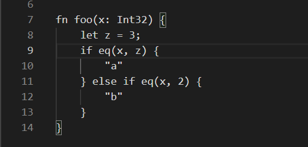

# deviz

deviz is a VS Code extension that displays structured program output such as trees and graphs.
It is intended to be used as a development tool for programs that work with this type of data.

deviz can show text output for any program, but to show structured output, your code has to use
a library to communicate the output to deviz.
Currently, only a Rust version of this library is available.

* [VS Code extension](TODO)
* [Rust library](TODO) - [documentation](TODO)

## Features

### Live output

### Directed graphs

### Hover text

## Extension Setup

Install the [VS Code extension](TODO).

A view will be added to the bottom of the Explorer, titled `DEVIZ`.
Click `Start session` within this view.
This view will list all of your input and output panes.
Click on the `info` pane to view the status of compilation/execution.

Open Workspace Setting and find the deviz settings.
You'll need to at least set the deviz `Run Command` setting, but you may also want to set
`Compile Command`.

Now when you modify the `stdin` pane, the stdout and stderr output for your program will appear
in the `stdout`/`stderr` panes.
